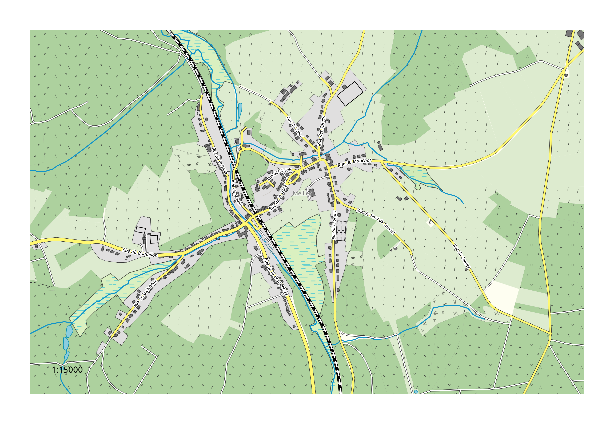
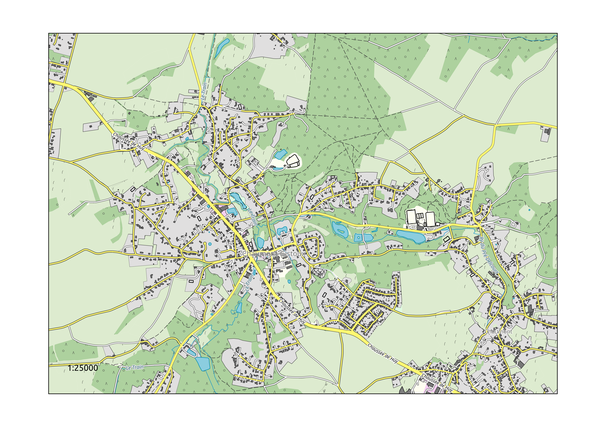
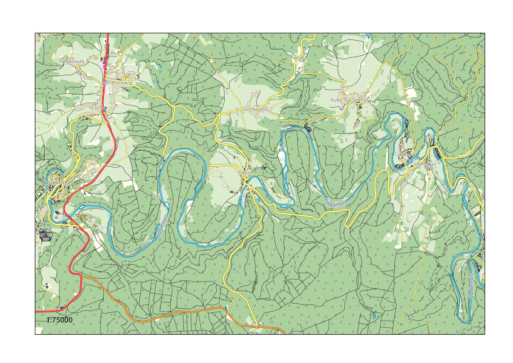

Map style for QGIS
------------------

This is a repository for styling OpenStreetMap (OSM) data in the Geofabrik shapefile format in QGIS.

# How to use it

If you want to quickly see the map style in action, download OSM extracts in shapefile format from http://download.geofabrik.de/, unzip the archive and put the shapefiles in a `/shp/` directory. Then, if you open the qgs project file, you should be able to see the shapefile with the correct style. There is also a proposed order of layers, with two layers that are duplicated.

Alternatively, you can create a new QGIS project, add the OSM Geofabrik extract shapefiles and loads the .qml style for each layer.  

The style is optimised for high scale maps, between 1:1000 and 1:100000.

# Utilities

There is a small Python script in `utils` for batch merging shapefiles from different regions/countries.

# Credits

This project is largely based on https://github.com/MrXsquared/OSM-Geofabrik_Universal-QML-Style. Thanks to the original developer of this style for updating legacy .qml map styles to QGIS3!

# License

This map style is licensed under the Creative Commons CC-SA-BY 4.0 license.

Please mention the following source:

> Map style by Champs-Libres Coop., distributed under CC BY-SA.

# More examples

